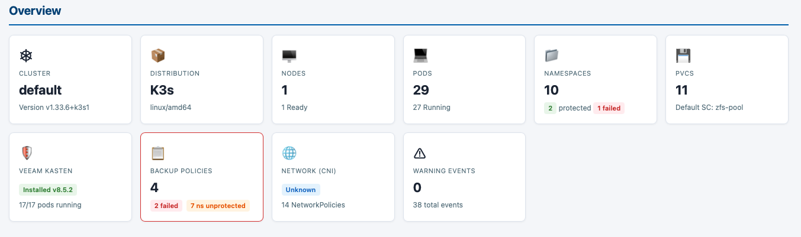
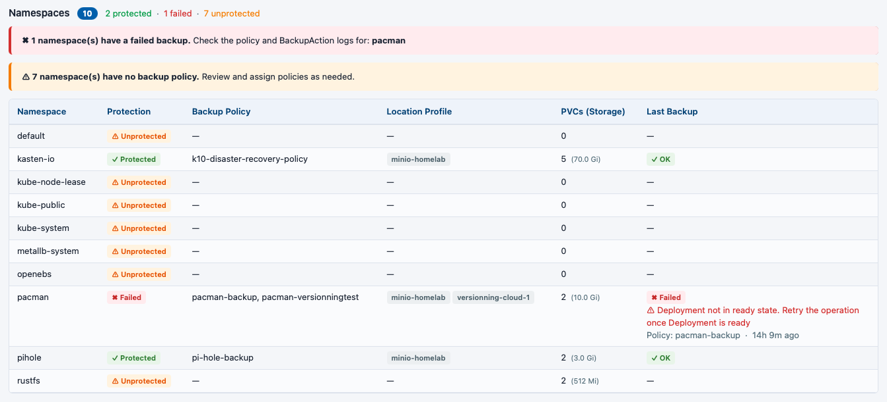
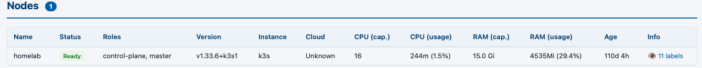
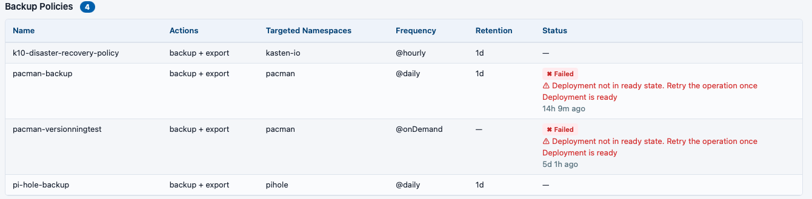
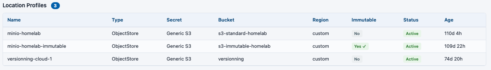
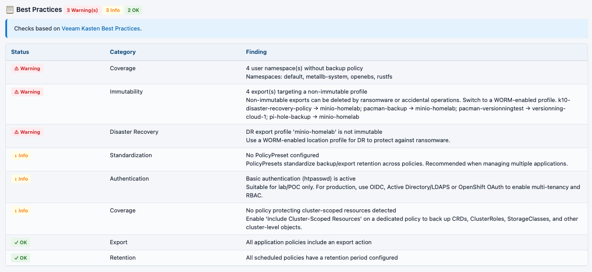

# Veeam Kasten Inventory Collector

**`veeam-kasten-inventory.html` v1.1.0** — A self-contained Bash script that collects Kubernetes cluster and Veeam Kasten K10 information and generates a single, portable HTML report.

The report can be shared, opened offline in any browser, and requires no external dependencies at viewing time.

---

## What it collects

| Section | Details |
|---------|---------|
| **Cluster Overview** | Distribution (K3s, K8s, OpenShift, RKE, AKS, EKS, GKE, Harvester), server version, context, namespace count |
| **Nodes** | Status, roles, instance type, CPU/memory capacity and usage (if metrics-server is available), kubelet version, age, labels, taints |
| **Pods** | All namespaces — phase, readiness, restart count, resource requests/limits, owner references |
| **Services** | Type, ClusterIP, LoadBalancer IP, ports, selectors |
| **Storage** | StorageClasses, PersistentVolumes, PersistentVolumeClaims, CSI Drivers, VolumeSnapshotClasses |
| **CRDs** | All CustomResourceDefinitions with group, scope, kind, and established status |
| **Operators (OLM)** | ClusterServiceVersions if OLM is installed |
| **Network Policies** | All namespaces |
| **Events** | All namespaces |
| **Veeam Kasten K10** | Pods, ConfigMaps, Policies, Location Profiles, Policy Presets, Restore Points, BackupActions, RunActions, PolicyRunActions, Helm values (optional) |

> If the `kasten-io` namespace is not found, the report is still generated — the Kasten section is simply empty.

---

## Prerequisites

| Tool | Minimum version | Purpose |
|------|----------------|---------|
| `kubectl` | Any recent version | Communicate with the cluster |
| `jq` | 1.6+ | Parse JSON responses |
| `python3` | 3.6+ | Generate the HTML report |

You must also have a valid `kubeconfig` with sufficient permissions to read cluster-wide resources (nodes, namespaces, pods, storage, CRDs, etc.).

### Install prerequisites on Ubuntu/Debian

```bash
apt install -y jq python3
# kubectl — official method:
curl -LO https://dl.k8s.io/release/$(curl -L -s https://dl.k8s.io/release/stable.txt)/bin/linux/amd64/kubectl
chmod +x kubectl && sudo mv kubectl /usr/local/bin/kubectl
```

### Install prerequisites on macOS

```bash
brew install jq python3 kubectl
```

---

## Installation

```bash
# Clone the repository
git clone https://github.com/cpouthier/kasten-inventory.git
cd kasten-inventory

# Make the script executable
chmod +x veeam-kasten-inventory.html
```

> The file has a `.html` extension but is a valid Bash script (`#!/usr/bin/env bash`). The extension is intentional — it has no effect on execution.

---

## Usage

### Basic (uses current kubeconfig context)

```bash
./veeam-kasten-inventory.html
```

The HTML report is written to `./build/` by default.

### All options

```bash
./veeam-kasten-inventory.html [OPTIONS]

OPTIONS:
  --kubeconfig <path>      Path to the kubeconfig file
                           (default: $KUBECONFIG or ~/.kube/config)
  --context <name>         Kubeconfig context to use
                           (default: current context)
  --output-dir <path>      Output directory for the HTML report
                           (default: ./build)
  --no-helm                Skip Helm values collection (recommended for security-sensitive environments)
  --no-ip-services         Mask IP addresses in the Services section
  --timeout <seconds>      kubectl request timeout in seconds (default: 60)
  -h, --help               Show this help
```

### Examples

```bash
# Use a specific context and output to /tmp
./veeam-kasten-inventory.html --context prod-cluster --output-dir /tmp/reports

# Skip Helm values and mask IPs (for sharing reports externally)
./veeam-kasten-inventory.html --no-helm --no-ip-services

# Target a specific kubeconfig with a longer timeout (large clusters)
./veeam-kasten-inventory.html --kubeconfig ~/.kube/prod.yaml --timeout 120

# Run against a remote cluster context
./veeam-kasten-inventory.html --context aks-westeurope --output-dir ./reports/aks-westeurope
```

---

## Output

After the script completes, the HTML report is saved in the output directory (default `./build/`):

```
./build/
└── veeam-kasten-inventory-<context>-<timestamp>.html
```

Open the file in any browser — no internet connection or server required.

---

## Permissions required

The script uses `kubectl get` (read-only) across cluster-wide and namespaced resources. The minimal ClusterRole needed is:

```yaml
apiVersion: rbac.authorization.k8s.io/v1
kind: ClusterRole
metadata:
  name: kasten-inventory-reader
rules:
  - apiGroups: [""]
    resources: ["namespaces", "nodes", "pods", "services", "persistentvolumes",
                "persistentvolumeclaims", "configmaps", "events"]
    verbs: ["get", "list"]
  - apiGroups: ["storage.k8s.io"]
    resources: ["storageclasses", "csidrivers"]
    verbs: ["get", "list"]
  - apiGroups: ["snapshot.storage.k8s.io"]
    resources: ["volumesnapshotclasses"]
    verbs: ["get", "list"]
  - apiGroups: ["apiextensions.k8s.io"]
    resources: ["customresourcedefinitions"]
    verbs: ["get", "list"]
  - apiGroups: ["operators.coreos.com"]
    resources: ["clusterserviceversions"]
    verbs: ["get", "list"]
  - apiGroups: ["networking.k8s.io"]
    resources: ["networkpolicies"]
    verbs: ["get", "list"]
  - apiGroups: ["config.kio.kasten.io"]
    resources: ["policies", "profiles", "policypresets"]
    verbs: ["get", "list"]
  - apiGroups: ["actions.kio.kasten.io"]
    resources: ["policyrunactions", "runactions", "backupactions"]
    verbs: ["get", "list"]
  - apiGroups: ["apps.kio.kasten.io"]
    resources: ["restorepoints"]
    verbs: ["get", "list"]
```

> `metrics.k8s.io` access is optional. If `metrics-server` is not installed, the CPU/memory usage columns are shown as N/A — the script continues without error.

---

## Screenshots

### Cluster Overview



*The summary header shows distribution type, Kubernetes version, node count, namespace count, and Kasten K10 version.*

### Namespaces



*All namespaces with status and age.*

### Nodes



*Node table with role, status, CPU/memory capacity and live usage (when metrics-server is available).*

### Veeam Kasten — Policies



*All backup policies with schedule, retention settings, and last run status.*

### Veeam Kasten — Location Profiles



*Object store and infrastructure profiles configured in Kasten, with endpoint and bucket details.*

### Veeam Kasten — Best Practices



*Best practice checks and recommendations for your Kasten installation.*

---

## Security notes

- The script is **read-only** — it never creates, modifies, or deletes any cluster resource.
- Use `--no-helm` to avoid collecting Kasten Helm release secrets (which may contain sensitive configuration values).
- Use `--no-ip-services` when sharing reports externally to mask IP addresses in the Services section.

---

## Supported distributions

Automatically detected and labeled in the report:

- Kubernetes (generic)
- K3s
- OpenShift
- Rancher / RKE
- AKS (Azure)
- EKS (AWS)
- GKE (Google Cloud)
- Harvester
