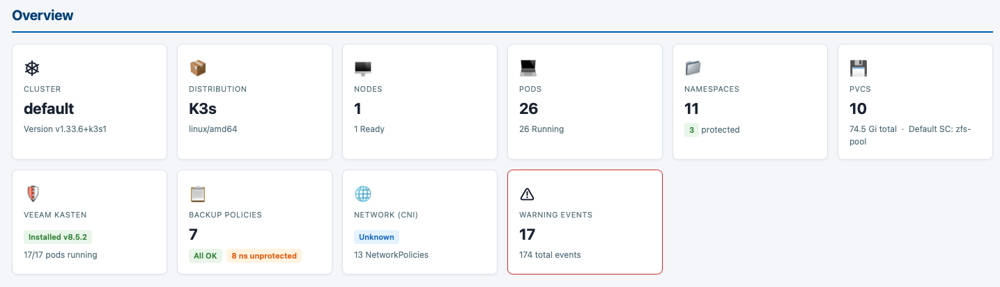
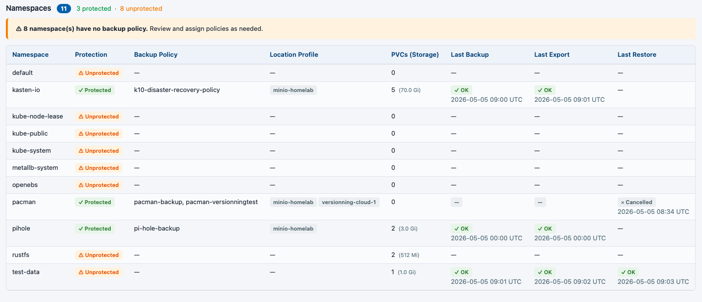
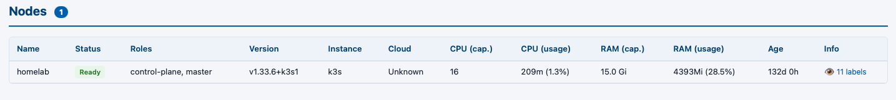
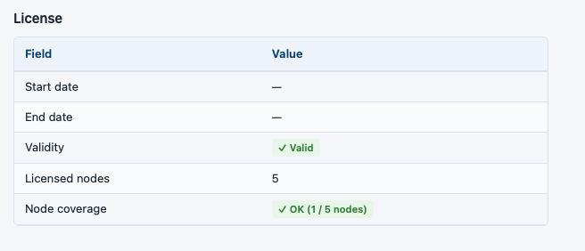
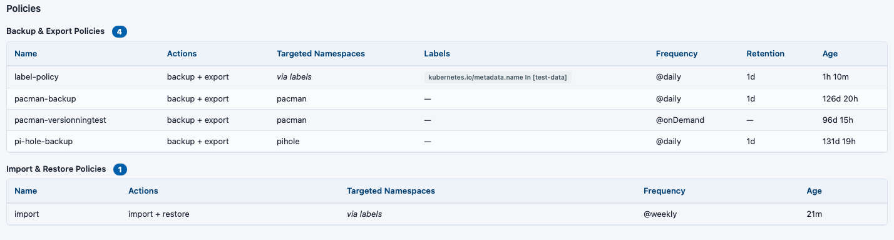
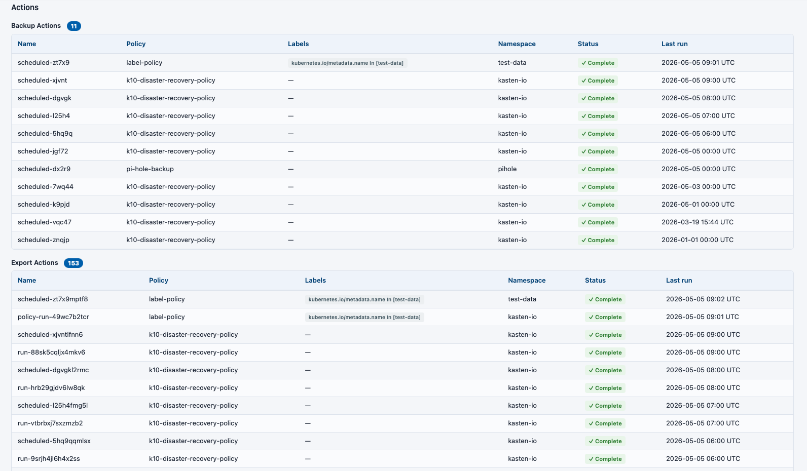
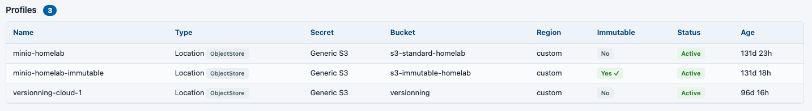
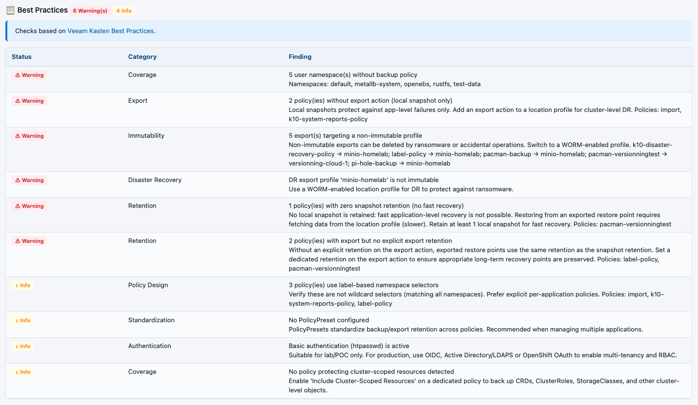

# Veeam Kasten Inventory Collector

**`veeam-kasten-inventory.sh` v1.4.0** — A self-contained Bash script that collects Kubernetes cluster and Veeam Kasten information and generates a single, portable HTML report.

The report can be shared, opened offline in any browser, and requires no external dependencies at viewing time.

---

## What it collects

| Section | Details |
|---------|---------|
| **Cluster Overview** | Distribution (K3s, K8s, OpenShift, RKE, AKS, EKS, GKE, Harvester), server version, context, namespace count, total PVC count and capacity |
| **Nodes** | Status, roles, instance type, CPU/memory capacity and usage (if metrics-server is available), kubelet version, age, labels, taints |
| **Pods** | All namespaces — phase, readiness, restart count, resource requests/limits, owner references |
| **Services** | Type, ClusterIP, LoadBalancer IP, ports, selectors |
| **Storage** | StorageClasses, PersistentVolumes, PersistentVolumeClaims (with per-namespace count and capacity), CSI Drivers, VolumeSnapshotClasses |
| **CRDs** | All CustomResourceDefinitions with group, scope, kind, and established status |
| **Operators (OLM)** | ClusterServiceVersions if OLM is installed |
| **Network / CNI** | Detected CNI type (Cilium, Calico, Flannel, Weave, Canal, Antrea, Multus, OVN…), CNI pod status, NetworkPolicies across all namespaces |
| **Events** | All namespaces, with Warning event count surfaced in the overview |
| **Veeam Kasten — License** | License validity, expiry date, licensed node limit, node coverage check, expiry and over-limit alerts |
| **Veeam Kasten — Policies** | Backup & Export Policies and Import & Restore Policies — with schedule, retention, targeted namespaces, label-based selectors, and policy age |
| **Veeam Kasten — Actions** | Backup Actions, Export Actions, and Restore Actions — each showing policy name, label selectors (for label-based policies), namespace, status badge (Complete / Failed / Skipped / Cancelled / Running), and last run date |
| **Veeam Kasten — Profiles** | Location profiles with type (`spec.type` e.g. Infra/Location, sub-type e.g. AWS/S3), credential type, bucket, region, and immutable/WORM status |
| **Namespace Protection** | Per-namespace: covering policy, export profile (WORM badge), PVC count/size, last backup status + date, last export status + date, last restore status + date |
| **Veeam Kasten — Kanister Resources** | Blueprints (with top-level action names e.g. `preSnapshot`, `postRestore`), BlueprintBindings, TransformSets |
| **Veeam Kasten — Disaster Recovery** | DR type (QuickDR / LegacyDR), export profile with immutability warning |
| **Veeam Kasten — Reports** | `k10-system-reports-policy` schedule and recent ReportActions |
| **Best Practices** | 11 automated checks: unprotected namespaces, policies without export, non-immutable export targets, no immutable profile, DR not configured / DR profile not immutable, label-only selectors, snapshot retention too high or zero, export without explicit retention, no PolicyPresets, NFS/SMB profiles, basic authentication active, no cluster-scoped resource policy |

> If the `kasten-io` namespace is absent, the script also checks for Kasten CRDs. If neither namespace nor CRDs are found, the report is still generated — the Kasten section shows "not installed".

---

## Report navigation

The left sidebar provides direct links to every section. Under **Veeam Kasten**, the following sub-sections are accessible directly:

| Nav entry | Content |
|-----------|---------|
| Licences | License validity, node coverage, expiry alerts |
| Policies | Backup/Export and Import/Restore policy tables |
| Actions | Backup Actions, Export Actions, Restore Actions |
| Namespaces | Per-namespace protection, backup/export/restore status and dates |
| Profiles | Location and infrastructure profiles |
| Blueprints | Kanister Blueprints and BlueprintBindings |
| Transformsets | Kasten TransformSets |
| Disaster Recovery | DR configuration and export profile check |
| Reports | Reporting policy schedule and recent report runs |
| Best Practices | Automated best-practice checks |

---

## Prerequisites

| Tool | Minimum version | Purpose |
|------|----------------|---------|
| `kubectl` | Any recent version | Communicate with the cluster |
| `jq` | 1.6+ | Parse JSON responses |
| `python3` | 3.6+ | Generate the HTML report |

You must also have a valid `kubeconfig` with sufficient permissions to read cluster-wide resources (nodes, namespaces, pods, storage, CRDs, etc.).

### Install prerequisites on Ubuntu/Debian

```bash
apt install -y jq python3
# kubectl — official method:
curl -LO https://dl.k8s.io/release/$(curl -L -s https://dl.k8s.io/release/stable.txt)/bin/linux/amd64/kubectl
chmod +x kubectl && sudo mv kubectl /usr/local/bin/kubectl
```
Change curl URLs as per your current hardware.

### Install prerequisites on macOS

```bash
brew install jq python3 kubectl
```

---

## Installation

```bash
# Clone the repository
git clone https://github.com/cpouthier/kasten-inventory.git
cd kasten-inventory

# Make the script executable
chmod +x veeam-kasten-inventory.sh
```

---

## Usage

### Basic (uses current kubeconfig context)

```bash
./veeam-kasten-inventory.sh
```

The HTML report is written to `./build/` by default.

### All options

```bash
./veeam-kasten-inventory.sh [OPTIONS]

OPTIONS:
  --kubeconfig <path>      Path to the kubeconfig file
                           (default: $KUBECONFIG or ~/.kube/config)
  --context <name>         Kubeconfig context to use
                           (default: current context)
  --output-dir <path>      Output directory for the HTML report
                           (default: ./build)
  --no-helm                Skip Helm values collection (recommended for security-sensitive environments)
  --no-ip-services         Mask IP addresses in the Services section
  --timeout <seconds>      kubectl request timeout in seconds (default: 60)
  -h, --help               Show this help
```

### Examples

```bash
# Use a specific context and output to /tmp
./veeam-kasten-inventory.sh --context prod-cluster --output-dir /tmp/reports

# Skip Helm values and mask IPs (for sharing reports externally)
./veeam-kasten-inventory.sh --no-helm --no-ip-services

# Target a specific kubeconfig with a longer timeout (large clusters)
./veeam-kasten-inventory.sh --kubeconfig ~/.kube/prod.yaml --timeout 120

# Run against a remote cluster context
./veeam-kasten-inventory.sh --context aks-westeurope --output-dir ./reports/aks-westeurope
```

---

## Output

After the script completes, the HTML report is saved in the output directory (default `./build/`):

```
./build/
└── veeam-kasten-inventory-<context>-<timestamp>.html
```

Open the file in any browser — no internet connection or server required.

---

## Permissions required

The script uses `kubectl get` (read-only) across cluster-wide and namespaced resources. The minimal ClusterRole needed is:

```yaml
apiVersion: rbac.authorization.k8s.io/v1
kind: ClusterRole
metadata:
  name: kasten-inventory-reader
rules:
  - apiGroups: [""]
    resources: ["namespaces", "nodes", "pods", "services", "persistentvolumes",
                "persistentvolumeclaims", "configmaps", "events", "secrets"]
    verbs: ["get", "list"]
  - apiGroups: ["storage.k8s.io"]
    resources: ["storageclasses", "csidrivers"]
    verbs: ["get", "list"]
  - apiGroups: ["snapshot.storage.k8s.io"]
    resources: ["volumesnapshotclasses"]
    verbs: ["get", "list"]
  - apiGroups: ["apiextensions.k8s.io"]
    resources: ["customresourcedefinitions"]
    verbs: ["get", "list"]
  - apiGroups: ["operators.coreos.com"]
    resources: ["clusterserviceversions"]
    verbs: ["get", "list"]
  - apiGroups: ["networking.k8s.io"]
    resources: ["networkpolicies"]
    verbs: ["get", "list"]
  - apiGroups: ["config.kio.kasten.io"]
    resources: ["policies", "profiles", "policypresets", "blueprintbindings", "transformsets"]
    verbs: ["get", "list"]
  - apiGroups: ["actions.kio.kasten.io"]
    resources: ["policyrunactions", "runactions", "backupactions", "exportactions",
                "restoreactions", "reportactions"]
    verbs: ["get", "list"]
  - apiGroups: ["apps.kio.kasten.io"]
    resources: ["restorepoints"]
    verbs: ["get", "list"]
  - apiGroups: ["cr.kanister.io"]
    resources: ["blueprints"]
    verbs: ["get", "list"]
```

> The `secrets` permission is required to read the `k10-license` secret for the License section.  
> `metrics.k8s.io` access is optional. If `metrics-server` is not installed, the CPU/memory usage columns are shown as N/A — the script continues without error.

---

## Screenshots (some...)

### Cluster Overview



*The summary header shows distribution type, Kubernetes version, node count, namespace count, total PVC count and capacity, and Veeam Kasten version.*

### Namespaces



*All namespaces with protection status, policy, export profile, PVC stats, and last backup / export / restore status with dates.*

### Nodes



*Node table with role, status, CPU/memory capacity and live usage (when metrics-server is available).*

### Veeam Kasten — License



*License validity, expiry date, licensed node count vs actual node count with coverage badge.*

### Veeam Kasten — Policies



*Backup/Export and Import/Restore policy tables with schedule, retention, targeted namespaces, label selectors, and policy age.*

### Veeam Kasten — Actions



*Backup Actions and Export Actions with policy name, label selectors, namespace, status badge, and last run date. Restore Actions with namespace, status, and date.*

### Veeam Kasten — Profiles



*Object store and infrastructure profiles with type (spec.type / sub-type), credential kind, bucket, region, and immutable/WORM status.*

### Veeam Kasten — Best Practices



*Best practice checks and recommendations for your Kasten installation.*

---

## Changelog

### v1.4.0
- **Overview**: PVC card now shows total storage capacity alongside PVC count
- **License section**: New section reads the `k10-license` secret and reports validity, expiry date, licensed node limit, and node coverage — with alerts for expiry ≤ 30 days and over-limit
- **Policies**: Removed "Last Run" column; added "Age" (policy creation age) and "Labels" (label-based namespace selectors displayed as badges)
- **Import & Restore Policies**: Added "Targeted Namespaces" column; replaced "Last Run" with "Age"
- **Actions**: New **Backup Actions** and **Export Actions** sections (Name, Policy, Labels, Namespace, Status, Last run); all three action sections (including Restore) now show formatted date instead of relative age
- **Profiles**: "Type" column now shows `spec.type` (e.g. `Infra`) with sub-type badge (e.g. `AWS`); infra profile credentials resolved from `spec.infra.credential`
- **Namespace protection**: Added "Last Export" column; all three action columns (Last Backup, Last Export, Last Restore) now show full status badge (OK / Failed / Skipped / Cancelled) and formatted date
- **Reports**: Fixed frequency display — `k10-system-reports-policy` now correctly shows `@daily` (was empty due to spec-level frequency not being parsed for non-backup actions)
- **Blueprints**: Fixed empty Actions column — Kanister stores action names at the top-level `actions` key, not inside `spec`
- **Navigation**: Veeam Kasten sub-navigation restructured to 10 entries: Licences, Policies, Actions, Namespaces, Profiles, Blueprints, Transformsets, Disaster Recovery, Reports, Best Practices
- **Permissions**: Added `exportactions` and `secrets` to the ClusterRole template

### v1.3.0
- Added Backup Actions, Restore Actions, Export Actions collection
- Added Kanister Blueprints, BlueprintBindings, TransformSets
- Added per-namespace last backup/restore tracking
- Added failed BackupAction detection per policy and namespace
- Added label-based namespace selector display in policies
- Improved DR export profile immutability warnings
